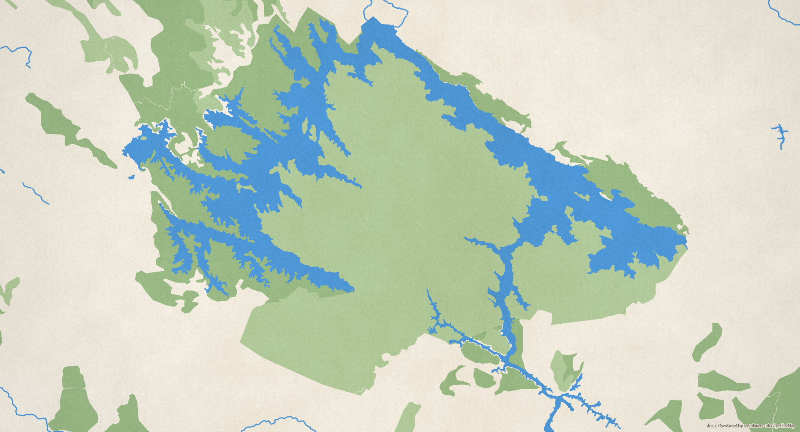

<h1 align="center">Deepak Antony · ജോർജുകുട്ടി</h1>

   
  

<!--LEVEL:START-->
Location: [Idukki reservoir](https://en.wikipedia.org/wiki/Idukki_Dam) · Water level: `2367.2 ft` / `2403 ft` (61.28%) · Last updated: 27/09/2026 11:00 AM
<!--LEVEL:END-->

  

---

Geographic data snapshot of one of my favourite places, [Idukki Reservoir](https://en.wikipedia.org/wiki/File:Idukki_Reservoir_Pano_Calvary_Mount_Kerala_Mar22_A7C_01220-23_Pano.jpg).
The image above shows the current water level in the reservoir, together with the weather at the location.

- **Water level:** [Kerala SDMA — Daily Dam Water Levels](https://sdma.kerala.gov.in/dam-water-level/) (KSEB daily report), extracted daily. The water colour and fill shift with the level — deep blue when full, pale when drawn down; the lake shape itself stays fixed.
- **Weather:** <!--WEATHER:START-->Overcast, 20.5°C<!--WEATHER:END--> at the reservoir, from [Open-Meteo](https://open-meteo.com), fetched daily.
- **Built with [map-paper](https://github.com/deepakvettickal/map-paper)** — my own cartographic poster renderer. Map data © OpenStreetMap contributors; tiles by OpenFreeMap.
