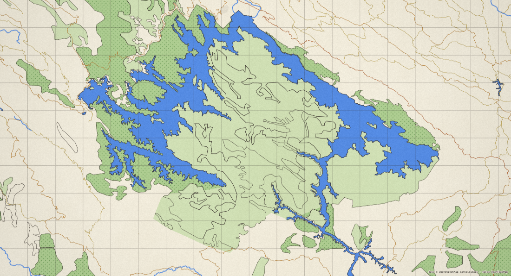

  <!--POSTER:START--><!--POSTER:END--> 
  

<!--LEVEL:START-->
Location: [Idukki reservoir](https://en.wikipedia.org/wiki/Idukki_Dam) · Water level: `2365.64 ft` / `2403 ft` (59.76% capacity) · Last updated: 09/10/2026 11:00 AM
<!--LEVEL:END-->

---

Geographic data snapshot of one of my favourite places, [Idukki Reservoir](https://en.wikipedia.org/wiki/File:Idukki_Reservoir_Pano_Calvary_Mount_Kerala_Mar22_A7C_01220-23_Pano.jpg).
The image above shows the current water level in the reservoir.

- **Water level:** [Kerala SDMA · Daily Dam Water Levels](https://sdma.kerala.gov.in/dam-water-level/) (KSEB daily report), extracted daily. The water's colour is keyed to the official alert levels: light → blue → orange → red. The scale under the map marks today's level from empty to full; the marker shows the water's height, and the % is its capacity (volume).
- **Weather:** <!--WEATHER:START-->Overcast, 20.7°C<!--WEATHER:END--> at the reservoir, from [Open-Meteo](https://open-meteo.com).
- **Built with [map-paper](https://github.com/deepakvettickal/map-paper).** Map data © OpenStreetMap contributors; tiles by OpenFreeMap.
